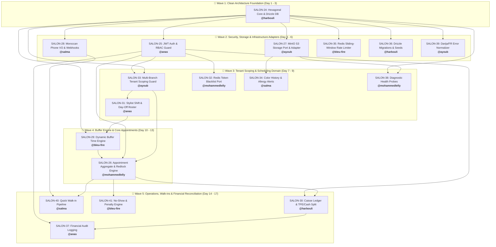

# SalonOps Morocco — Cycle 1: Mobile Prototype Backend Dependency Matrix

> **Sprint Cycle:** `Cycle 1: Mobile Prototype`  
> **Project Management:** [Plane Dashboard (SalonOps Morocco)](https://plane.harbouli.dev/trainimaya/projects/ecefc364-a7d7-4bde-9a0d-0c0349676484/cycles/43dfe00e-d4b5-414d-8e3e-182ba9e41716)  
> **Total Backend Tasks:** 18 tasks  
> **Architecture Standard:** Clean Architecture, Domain-Driven Design (DDD) & Hexagonal Architecture (Ports and Adapters)  
> **Team Allocation:** 3 tasks per member across 6 engineers  

---

## 🏛️ Mandatory Backend Architecture Principles

All backend tasks in this sprint must strictly adhere to **Clean Architecture**, **DDD**, and **Hexagonal Architecture**:

1. **Domain Layer (`apps/api/src/domain/`)**: Pure TypeScript business core. **Zero external dependencies** (no Express, Drizzle, SQL, or Redis). Houses Aggregate Roots, Entities, Value Objects (`Money`, `TimeSlot`, `MoroccanPhoneNumber`), Domain Services, Domain Exceptions (`DomainException`), and Outbound Ports (`I...Repository`, `IDistributedLockPort`).
2. **Application Layer (`apps/api/src/application/`)**: Inbound Ports (Use Case interfaces in `ports/`), Use Case Implementations (`use-cases/`), and DTOs. Orchestrates domain logic and calls outbound ports. Contains **zero HTTP or SQL logic**.
3. **Infrastructure Layer (`apps/api/src/infrastructure/`)**: Driven Adapters. Drizzle ORM repositories (`persistence/`), Redis/Redlock adapters (`concurrency/`), external integrations (MinIO S3), and the central Composition Root (`container.ts`).
4. **Presentation Layer (`apps/api/src/presentation/`)**: Driving Adapters. Express REST Controllers (`controllers/`), Route definitions (`routes/`), Zod validation schemas (`validation/`), and centralized error handling middleware (`errorHandlerMiddleware`).

---

## 👥 Equal Team Allocation Summary

| Team Member | Username | Assigned Tasks | Role / Primary Domain |
| :--- | :--- | :--- | :--- |
| **Mohamed Harbouli** | `@harbouli.me` | `SALON-24`, `SALON-30`, `SALON-36` | Architecture Core, Caisse Ledger, Migrations & Seeds |
| **Anas Dalfag** | `@dalfaganis` | `SALON-25`, `SALON-31`, `SALON-37` | JWT / Granular RBAC, Shift Rosters, Audit Trails |
| **Mohammed Lelly** | `@mohammedlelly2006` | `SALON-26`, `SALON-32`, `SALON-38` | Appointment & Redlock Engine, Redis Token Blacklist, Health Probes |
| **Ayoub Ennaoui** | `@ayoubnaoui00` | `SALON-27`, `SALON-33`, `SALON-39` | MinIO S3 Integration, Multi-Tenant Scoping, Darija/FR i18n |
| **Salma Mirat** | `@salmamirat` | `SALON-28`, `SALON-34`, `SALON-40` | Moroccan Phone Validator, Color Formulas, Walk-In Pipeline |
| **Bleu-fire / Oussama** | `@oussamannajag` | `SALON-29`, `SALON-35`, `SALON-41` | Dynamic Buffer Engine, Rate Limiting, No-Show Penalties |

---

## ⛓️ Execution Waves & Dependency Graph

---

## 📋 Comprehensive Task Details & Hexagonal Architecture Specs

### 1. `SALON-24` — [BACKEND-01] Clean / Hexagonal Architecture Foundation & Database Wiring
- **Lead:** Mohamed Harbouli (`@harbouli.me`)
- **Blocked By:** *None* (Genesis Task)
- **Blocks:** `SALON-25` through `SALON-39`
- **Architectural Layers:**
  - **Domain:** `domain/exceptions/domain.exception.ts`, base entities & value objects.
  - **Infrastructure:** `packages/database/src/index.ts`, `infrastructure/container.ts` (Composition Root).
  - **Presentation:** `src/app.ts`, `presentation/middleware/error-handler.middleware.ts`.
- **Key Deliverable:** Establish Clean Architecture / Hexagonal layer boundaries, Drizzle PostgreSQL connection pool, and Centralized Domain Exception handler.

---

### 2. `SALON-25` — [BACKEND-02] Authentication & Granular RBAC Guard
- **Lead:** Anas Dalfag (`@dalfaganis`)
- **Blocked By:** `SALON-24`
- **Blocks:** `SALON-26`, `SALON-30`, `SALON-32`, `SALON-33`, `SALON-37`
- **Architectural Layers:**
  - **Domain:** `domain/ports/password-hasher.port.ts`, `domain/ports/token-service.port.ts`.
  - **Application:** `application/ports/auth.port.ts`, `application/use-cases/authenticate-user.use-case.ts`.
  - **Infrastructure:** `infrastructure/security/argon2-password-hasher.adapter.ts`, `infrastructure/security/jwt-token.adapter.ts`.
  - **Presentation:** `presentation/controllers/auth.controller.ts`, `presentation/routes/auth.routes.ts`, `presentation/middleware/auth.middleware.ts`, `presentation/middleware/rbac.middleware.ts`.
- **Key Deliverable:** Argon2 password hashing, JWT token generation, and granular RBAC middleware protecting owner analytics from floor staff.

---

### 3. `SALON-26` — [BACKEND-03] Core Appointment Aggregate & Concurrency Redlock Engine
- **Lead:** Mohammed Lelly (`@mohammedlelly2006`)
- **Blocked By:** `SALON-24`, `SALON-25`, `SALON-29`, `SALON-33`
- **Blocks:** `SALON-30`, `SALON-40`, `SALON-41`
- **Architectural Layers:**
  - **Domain:** `domain/models/appointment.entity.ts`, `domain/value-objects/time-slot.vo.ts`, `domain/services/appointment-collision.service.ts`, `domain/ports/appointment-repository.port.ts`, `domain/ports/distributed-lock.port.ts`.
  - **Application:** `application/ports/book-appointment.port.ts`, `application/use-cases/book-appointment.use-case.ts`, `application/use-cases/get-appointments.use-case.ts`, `application/use-cases/update-appointment-status.use-case.ts`.
  - **Infrastructure:** `infrastructure/persistence/drizzle-appointment.repository.ts`, `infrastructure/concurrency/redis-distributed-lock.adapter.ts`.
  - **Presentation:** `presentation/controllers/appointment.controller.ts`, `presentation/routes/appointment.routes.ts`, `presentation/validation/schemas.ts`.
- **Key Deliverable:** Complete appointment aggregate root with distributed Redlock concurrency guard, preventing double-booking identical stylist slots.

---

### 4. `SALON-27` — [BACKEND-04] MinIO S3 Object Storage Port & Presigned URL Adapter
- **Lead:** Ayoub Ennaoui (`@ayoubnaoui00`)
- **Blocked By:** `SALON-24`
- **Blocks:** `SALON-34`, `SALON-38`
- **Architectural Layers:**
  - **Domain:** `domain/ports/object-storage.port.ts` (`getPresignedUploadUrl`, `getPublicUrl`).
  - **Application:** `application/ports/storage.port.ts`, `application/use-cases/generate-upload-url.use-case.ts`.
  - **Infrastructure:** `infrastructure/storage/minio-storage.adapter.ts` (provisions `salonops-hair-photos`, `salonops-receipts`).
  - **Presentation:** `presentation/controllers/storage.controller.ts`, `presentation/routes/storage.routes.ts`.
- **Key Deliverable:** Outbound MinIO S3 adapter generating 15-minute presigned PUT URLs for client transformation photos.

---

### 5. `SALON-28` — [BACKEND-05] Moroccan Phone Value Object & WhatsApp Notification Port
- **Lead:** Salma Mirat (`@salmamirat`)
- **Blocked By:** `SALON-24`
- **Blocks:** `SALON-40`
- **Architectural Layers:**
  - **Domain:** `domain/value-objects/phone-number.vo.ts` (validates `06...`, `07...`, `+212...`, IAM/Orange/Inwi carrier detection), `domain/ports/notification.port.ts`.
  - **Application:** `application/use-cases/send-reminder.use-case.ts`, `application/use-cases/process-webhook.use-case.ts`.
  - **Infrastructure:** `infrastructure/notifications/whatsapp-notification.adapter.ts`.
  - **Presentation:** `presentation/controllers/webhook.controller.ts`, `presentation/routes/webhook.routes.ts`.
- **Key Deliverable:** Moroccan phone normalization value object and WhatsApp notification adapter for 24h & 2h reminders.

---

### 6. `SALON-29` — [BACKEND-06] Dynamic Buffer Time & Cleaning Interval Domain Service
- **Lead:** Bleu-fire / Oussama (`@oussamannajag`)
- **Blocked By:** `SALON-24`, `SALON-31`
- **Blocks:** `SALON-26`
- **Architectural Layers:**
  - **Domain:** `domain/value-objects/time-slot.vo.ts` (`bufferEndTime`, `overlapsWith`), `domain/services/appointment-collision.service.ts`.
  - **Application:** `application/use-cases/calculate-buffer.use-case.ts`.
  - **Infrastructure:** Registered in `container.ts` and utilized by `BookAppointmentUseCase`.
  - **Presentation:** Configurable buffer duration parameters in `presentation/validation/schemas.ts`.
- **Key Deliverable:** Moroccan salon buffer engine ensuring chemical treatments (lissage, balayage) enforce station cleaning and ventilation buffer windows.

---

### 7. `SALON-30` — [BACKEND-07] End-of-Day Caisse Reconciliation & Moroccan Split Ledger
- **Lead:** Mohamed Harbouli (`@harbouli.me`)
- **Blocked By:** `SALON-24`, `SALON-25`, `SALON-26`
- **Blocks:** `SALON-37`
- **Architectural Layers:**
  - **Domain:** `domain/models/transaction.entity.ts`, `domain/value-objects/money.vo.ts` (zero float MAD arithmetic, variance check), `domain/ports/transaction-repository.port.ts`.
  - **Application:** `application/ports/process-checkout.port.ts`, `application/use-cases/process-checkout.use-case.ts`.
  - **Infrastructure:** `infrastructure/persistence/drizzle-transaction.repository.ts`.
  - **Presentation:** `presentation/controllers/checkout.controller.ts`, `presentation/routes/checkout.routes.ts`.
- **Key Deliverable:** Daily cash register opening/closing, split checkouts (Cash MAD + TPE card CMI), and automatic stylist commission calculation.

---

### 8. `SALON-31` — [BACKEND-08] Stylist Shift Schedule & Day-Off Roster
- **Lead:** Anas Dalfag (`@dalfaganis`)
- **Blocked By:** `SALON-24`, `SALON-33`
- **Blocks:** `SALON-29`, `SALON-26`
- **Architectural Layers:**
  - **Domain:** `domain/models/stylist.entity.ts` (`isAvailableFor(slot)`, `workingStart`, `workingEnd`, `isDayOff`), `domain/ports/stylist-repository.port.ts`.
  - **Application:** `application/ports/get-stylists.port.ts`, `application/use-cases/get-stylists.use-case.ts`.
  - **Infrastructure:** `infrastructure/persistence/drizzle-stylist.repository.ts`.
  - **Presentation:** `presentation/controllers/stylist.controller.ts`, `presentation/routes/stylist.routes.ts`.
- **Key Deliverable:** Stylist working hours and day-off roster validation directly inside domain entity models.

---

### 9. `SALON-32` — [BACKEND-09] Redis Token Blacklist Port & Session Revocation Adapter
- **Lead:** Mohammed Lelly (`@mohammedlelly2006`)
- **Blocked By:** `SALON-25`
- **Blocks:** *None* (Security Hardening)
- **Architectural Layers:**
  - **Domain:** `domain/ports/token-blacklist.port.ts` (`isRevoked`, `revokeToken`).
  - **Application:** `application/use-cases/revoke-session.use-case.ts`.
  - **Infrastructure:** `infrastructure/security/redis-token-blacklist.adapter.ts`.
  - **Presentation:** `presentation/middleware/token-blacklist.middleware.ts`.
- **Key Deliverable:** Instant JWT token invalidation via Redis TTL entries on staff logout or managerial termination.

---

### 10. `SALON-33` — [BACKEND-10] Multi-Branch Tenant Scoping Port & Middleware Guard
- **Lead:** Ayoub Ennaoui (`@ayoubnaoui00`)
- **Blocked By:** `SALON-24`, `SALON-25`
- **Blocks:** `SALON-26`, `SALON-30`, `SALON-31`
- **Architectural Layers:**
  - **Domain:** `domain/ports/tenant-context.port.ts`.
  - **Application:** Scoped repository queries in all use cases enforcing `branchId`.
  - **Infrastructure:** Multi-tenant query wrappers in Drizzle repositories.
  - **Presentation:** `presentation/middleware/tenant-guard.middleware.ts` extracting branch context from JWT or headers.
- **Key Deliverable:** Data isolation preventing leaks between different salon branches in Casablanca, Rabat, and Marrakech.

---

### 11. `SALON-34` — [BACKEND-11] Client Color History & Hair Formula Vault ("Notebook Killer")
- **Lead:** Salma Mirat (`@salmamirat`)
- **Blocked By:** `SALON-24`, `SALON-27`
- **Blocks:** Mobile Stylist Technical Sheet
- **Architectural Layers:**
  - **Domain:** `domain/models/hair-formula.entity.ts`, `domain/models/client.entity.ts`, `domain/ports/hair-formula-repository.port.ts`, `domain/ports/client-repository.port.ts`.
  - **Application:** `application/ports/hair-formulas.port.ts`, `application/use-cases/hair-formulas.use-cases.ts`.
  - **Infrastructure:** `infrastructure/persistence/drizzle-hair-formula.repository.ts`, `infrastructure/persistence/drizzle-client.repository.ts`.
  - **Presentation:** `presentation/controllers/client.controller.ts` (`GET/POST /api/v1/clients/:id/formulas`).
- **Key Deliverable:** Digital color formula vault tracking bleach ratios, developer volumes, processing times, and transformation photos.

---

### 12. `SALON-35` — [BACKEND-12] Redis Rate Limiting Adapter & Abuse Protection Guard
- **Lead:** Bleu-fire / Oussama (`@oussamannajag`)
- **Blocked By:** `SALON-24`
- **Blocks:** Public Booking Routes
- **Architectural Layers:**
  - **Domain:** `domain/ports/rate-limiter.port.ts`.
  - **Infrastructure:** `infrastructure/security/redis-rate-limiter.adapter.ts`.
  - **Presentation:** Express rate-limiting middleware configured with tiered limits (strict for auth/OTP, standard for catalogs).
- **Key Deliverable:** Abuse and DDoS mitigation protecting public bio booking and OTP SMS endpoints.

---

### 13. `SALON-36` — [BACKEND-13] Drizzle ORM Moroccan Seed Fixtures & Migration Runner
- **Lead:** Mohamed Harbouli (`@harbouli.me`)
- **Blocked By:** `SALON-24`
- **Blocks:** Developer Test Simulator
- **Architectural Layers:**
  - **Infrastructure:** `packages/database/src/seed.ts`, `packages/database/src/schema/`.
- **Key Deliverable:** Idempotent database seeder with realistic Moroccan salon fixtures (Maarif, Agdal), services in MAD, and hashed test users.

---

### 14. `SALON-37` — [BACKEND-14] API Financial Audit Logging & Modification Trail
- **Lead:** Anas Dalfag (`@dalfaganis`)
- **Blocked By:** `SALON-25`, `SALON-30`
- **Blocks:** Financial Compliance Reporting
- **Architectural Layers:**
  - **Domain:** `domain/models/audit-log.entity.ts`, `domain/ports/audit-log-repository.port.ts`.
  - **Application:** `application/use-cases/record-audit-event.use-case.ts`.
  - **Infrastructure:** `infrastructure/persistence/drizzle-audit-log.repository.ts`.
  - **Presentation:** `presentation/middleware/audit-logger.middleware.ts` capturing price overrides, manual discounts, and deletions.
- **Key Deliverable:** Immutable audit trail logging actor ID, timestamp, and before/after JSON diffs on financial adjustments.

---

### 15. `SALON-38` — [BACKEND-15] Automated Health Probe & Diagnostic Monitoring
- **Lead:** Mohammed Lelly (`@mohammedlelly2006`)
- **Blocked By:** `SALON-24`, `SALON-27`
- **Blocks:** Docker Compose & VPS Production Healthchecks
- **Architectural Layers:**
  - **Domain:** `domain/ports/health-check.port.ts`.
  - **Application:** `application/use-cases/check-health.use-case.ts`.
  - **Infrastructure:** `infrastructure/diagnostic/system-health.adapter.ts` probing PostgreSQL pool, Redis ping, MinIO bucket.
  - **Presentation:** `presentation/controllers/health.controller.ts`, `presentation/routes/health.routes.ts` (`/health`, `/livez`, `/readyz`).
- **Key Deliverable:** Production container diagnostic probes ensuring database, Redis, and MinIO readiness.

---

### 16. `SALON-39` — [BACKEND-16] Moroccan Darija & French Bilingual Error Response Normalizer
- **Lead:** Ayoub Ennaoui (`@ayoubnaoui00`)
- **Blocked By:** `SALON-24`
- **Blocks:** Mobile React Native UI Toast Alerts
- **Architectural Layers:**
  - **Domain:** `domain/exceptions/domain.exception.ts` (custom domain error hierarchy with message keys).
  - **Presentation:** `presentation/middleware/error-handler.middleware.ts`, `presentation/locales/errors.fr.ts`, `presentation/locales/errors.darija.ts`.
- **Key Deliverable:** Centralized error handler translating Domain Exceptions into standardized bilingual JSON responses based on `Accept-Language`.

---

### 17. `SALON-40` — [BACKEND-17] Walk-In Quick Appointment & Client Auto-Creation Pipeline
- **Lead:** Salma Mirat (`@salmamirat`)
- **Blocked By:** `SALON-26`, `SALON-28`
- **Blocks:** 1-Tap Mobile Floor Counter Walk-in Button
- **Architectural Layers:**
  - **Domain:** `domain/models/appointment.entity.ts` (`startInChair()`), `domain/models/client.entity.ts`, Value Object `DailyTicketNumber`.
  - **Application:** `application/ports/walk-in.port.ts`, `application/use-cases/create-walk-in.use-case.ts`.
  - **Infrastructure:** `infrastructure/persistence/drizzle-appointment.repository.ts`, `infrastructure/persistence/drizzle-client.repository.ts`.
  - **Presentation:** `presentation/controllers/walk-in.controller.ts`, `presentation/routes/walk-in.routes.ts` (`POST /api/v1/appointments/quick-walkin`).
- **Key Deliverable:** Sub-100ms walk-in appointment endpoint auto-resolving client profile by phone and seating client on the next free stylist chair.

---

### 18. `SALON-41` — [BACKEND-18] Appointment Cancellation & No-Show Penalty Tracking Engine
- **Lead:** Bleu-fire / Oussama (`@oussamannajag`)
- **Blocked By:** `SALON-26`
- **Blocks:** Client Reliability Score & Deposit Enforcement
- **Architectural Layers:**
  - **Domain:** `domain/models/appointment.entity.ts` (`cancel()`, `markNoShow()`), `domain/models/client.entity.ts`, Value Object `ReliabilityScore`.
  - **Application:** `application/ports/update-appointment-status.port.ts`, `application/use-cases/update-appointment-status.use-case.ts`.
  - **Infrastructure:** `infrastructure/persistence/drizzle-appointment.repository.ts`, `infrastructure/persistence/drizzle-client.repository.ts`.
  - **Presentation:** `presentation/controllers/appointment.controller.ts` (`PATCH /api/v1/appointments/:id/status`, `POST /api/v1/appointments/:id/cancel`, `POST /api/v1/appointments/:id/no-show`).
- **Key Deliverable:** Cancellation window compliance, salon no-show logging, and automated client reliability scoring to flag chronic no-shows.
