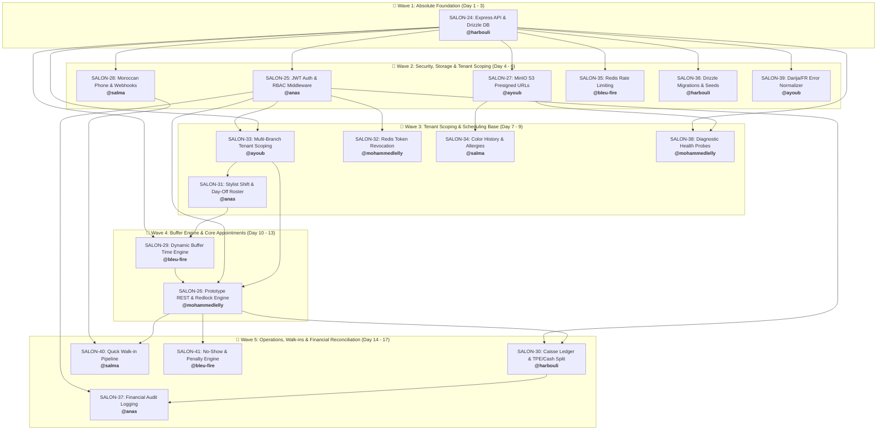

# SalonOps Morocco — Cycle 1: Mobile Prototype Backend Dependency Matrix

> **Sprint Cycle:** `Cycle 1: Mobile Prototype`  
> **Project Management:** [Plane Dashboard (SalonOps Morocco)](https://plane.harbouli.dev/trainimaya/projects/ecefc364-a7d7-4bde-9a0d-0c0349676484/cycles/43dfe00e-d4b5-414d-8e3e-182ba9e41716)  
> **Total Backend Tasks:** 18 tasks  
> **Team Allocation:** 3 tasks per member across 6 engineers  

---

## 👥 Equal Team Allocation Summary

| Team Member | Username | Assigned Tasks | Role / Primary Domain |
| :--- | :--- | :--- | :--- |
| **Mohamed Harbouli** | `@harbouli.me` | `SALON-24`, `SALON-30`, `SALON-36` | Architecture Core, Caisse Ledger, Migrations & Seeds |
| **Anas Dalfag** | `@dalfaganis` | `SALON-25`, `SALON-31`, `SALON-37` | JWT / Granular RBAC, Shift Rosters, Audit Trails |
| **Mohammed Lelly** | `@mohammedlelly2006` | `SALON-26`, `SALON-32`, `SALON-38` | Appointment & Redlock Engine, Redis Token Blacklist, Health Probes |
| **Ayoub Ennaoui** | `@ayoubnaoui00` | `SALON-27`, `SALON-33`, `SALON-39` | MinIO S3 Integration, Multi-Tenant Scoping, Darija/FR i18n |
| **Salma Mirat** | `@salmamirat` | `SALON-28`, `SALON-34`, `SALON-40` | Moroccan Phone Validator, Color Formulas, Walk-In Pipeline |
| **Bleu-fire / Oussama** | `@oussamannajag` | `SALON-29`, `SALON-35`, `SALON-41` | Dynamic Buffer Engine, Rate Limiting, No-Show Penalties |

---

## ⛓️ Full Execution Waves & Dependency Graph

---

## 📋 Comprehensive Task Details & Implementation Specs

### 1. `SALON-24` — [BACKEND-01] Express API Foundation, Drizzle PostgreSQL Schema Setup & Monorepo Wiring
- **Lead:** Mohamed Harbouli (`@harbouli.me`)
- **Blocked By:** *None* (Genesis Task)
- **Blocks:** `SALON-25`, `SALON-26`, `SALON-27`, `SALON-28`, `SALON-29`, `SALON-31`, `SALON-33`, `SALON-35`, `SALON-36`, `SALON-38`, `SALON-39`
- **Target Files:** `apps/api/src/index.ts`, `packages/database/src/schema/index.ts`, `packages/database/src/client.ts`
- **Key Deliverable:** Base Express router setup, PostgreSQL pool via Drizzle ORM, Zod error interceptor.

---

### 2. `SALON-25` — [BACKEND-02] JWT Auth & Granular RBAC Middleware
- **Lead:** Anas Dalfag (`@dalfaganis`)
- **Blocked By:** `SALON-24`
- **Blocks:** `SALON-26`, `SALON-30`, `SALON-32`, `SALON-33`, `SALON-37`
- **Target Files:** `apps/api/src/middleware/auth.ts`, `apps/api/src/middleware/rbac.ts`, `apps/api/src/routes/auth.ts`
- **Key Deliverable:** Argon2 password hashing, dual JWT token rotation (Access + Refresh), Moroccan Salon roles (`SUPER_ADMIN`, `SALON_OWNER`, `SALON_MANAGER`, `STYLIST`, `RECEPTIONIST`, `CLIENT`).

---

### 3. `SALON-26` — [BACKEND-03] Core Prototype REST Endpoints: Appointments, Services & Stylists
- **Lead:** Mohammed Lelly (`@mohammedlelly2006`)
- **Blocked By:** `SALON-24`, `SALON-25`, `SALON-29`, `SALON-33`
- **Blocks:** `SALON-30`, `SALON-40`, `SALON-41`
- **Target Files:** `apps/api/src/routes/appointments.ts`, `apps/api/src/services/booking.ts`, `apps/api/src/utils/redlock.ts`
- **Key Deliverable:** Full appointment scheduling, distributed concurrency lock via Redlock to prevent double-booking identical chair/stylist slots.

---

### 4. `SALON-27` — [BACKEND-04] MinIO S3 Client Integration & Presigned URL Generation Service
- **Lead:** Ayoub Ennaoui (`@ayoubnaoui00`)
- **Blocked By:** `SALON-24`
- **Blocks:** `SALON-34`, `SALON-38`
- **Target Files:** `apps/api/src/services/storage.service.ts`, `apps/api/src/routes/storage.routes.ts`, `apps/api/src/config/minio.config.ts`
- **Key Deliverable:** MinIO JS S3 client wrapper, bucket auto-provisioning (`salonops-hair-photos`, `salonops-receipts`), 15-minute presigned PUT URLs for direct client uploads.

---

### 5. `SALON-28` — [BACKEND-05] Moroccan Phone Validation & WhatsApp Reminder Webhook Infrastructure
- **Lead:** Salma Mirat (`@salmamirat`)
- **Blocked By:** `SALON-24`
- **Blocks:** `SALON-40`
- **Target Files:** `apps/api/src/utils/phone.validator.ts`, `apps/api/src/services/notification.service.ts`, `apps/api/src/routes/webhook.routes.ts`
- **Key Deliverable:** Moroccan phone parser (`06...`, `07...`, `+212...`), IAM/Orange/Inwi carrier detection, E.164 normalization, and bilingual reminder webhook infrastructure.

---

### 6. `SALON-29` — [BACKEND-06] Dynamic Buffer Time & Cleaning Interval Engine
- **Lead:** Bleu-fire / Oussama (`@oussamannajag`)
- **Blocked By:** `SALON-24`, `SALON-31`
- **Blocks:** `SALON-26`
- **Target Files:** `apps/api/src/services/buffer.service.ts`, `packages/database/src/schema/services.ts`
- **Key Deliverable:** Scheduling math service incorporating Moroccan salon turnover buffers (station sanitization, blade disinfection, hair wash transition, chemical processing).

---

### 7. `SALON-30` — [BACKEND-07] End-of-Day Caisse Reconciliation & Moroccan Cash/TPE Split Ledger API
- **Lead:** Mohamed Harbouli (`@harbouli.me`)
- **Blocked By:** `SALON-24`, `SALON-25`, `SALON-26`
- **Blocks:** `SALON-37`
- **Target Files:** `apps/api/src/routes/caisse.routes.ts`, `apps/api/src/services/caisse.service.ts`, `packages/database/src/schema/caisse.ts`
- **Key Deliverable:** Daily cash register opening/closing (Fond de Caisse), split payments (Cash MAD + TPE card e.g. CMI), and variance calculation (Écart de caisse).

---

### 8. `SALON-31` — [BACKEND-08] Stylist Shift Schedule & Day-Off Roster Endpoints
- **Lead:** Anas Dalfag (`@dalfaganis`)
- **Blocked By:** `SALON-24`, `SALON-33`
- **Blocks:** `SALON-29`, `SALON-26`
- **Target Files:** `apps/api/src/routes/schedules.routes.ts`, `packages/database/src/schema/schedules.ts`
- **Key Deliverable:** 7-day weekly schedule CRUD, lunch break definitions (13:00 - 14:30), Friday prayer adjustments (Salat al-Jumu'ah), and staff vacation requests.

---

### 9. `SALON-32` — [BACKEND-09] Redis Token Blacklist & Session Revocation Middleware
- **Lead:** Mohammed Lelly (`@mohammedlelly2006`)
- **Blocked By:** `SALON-25`
- **Blocks:** *None* (Security Hardening)
- **Target Files:** `apps/api/src/middleware/tokenBlacklist.ts`, `apps/api/src/services/auth.service.ts`, `apps/api/src/utils/redis.ts`
- **Key Deliverable:** Instant JWT invalidation via Redis TTL entries on user logout, password reset, or manager termination.

---

### 10. `SALON-33` — [BACKEND-10] Multi-Branch Data Isolation & Moroccan Tenant Scoping Guard
- **Lead:** Ayoub Ennaoui (`@ayoubnaoui00`)
- **Blocked By:** `SALON-24`, `SALON-25`
- **Blocks:** `SALON-26`, `SALON-30`, `SALON-31`
- **Target Files:** `apps/api/src/middleware/tenantGuard.ts`, `packages/database/src/helpers/tenantFilter.ts`
- **Key Deliverable:** Strict multi-branch tenancy enforcement preventing data leakage across different salon branches in Casablanca, Rabat, or Marrakech.

---

### 11. `SALON-34` — [BACKEND-11] Client Color History & Allergy Alert Notification Service
- **Lead:** Salma Mirat (`@salmamirat`)
- **Blocked By:** `SALON-24`, `SALON-27`
- **Blocks:** Mobile Stylist Technical Card View
- **Target Files:** `apps/api/src/routes/technicalSheets.routes.ts`, `packages/database/src/schema/clientTechnical.ts`
- **Key Deliverable:** Technical hair consultation history (Fiche Technique) storing chemical formulas (Olaplex, Majirel developer volumes), allergy reactions (PPD), and before/after transformation photos.

---

### 12. `SALON-35` — [BACKEND-12] Rate Limiting & Moroccan DDoS Protection Middleware
- **Lead:** Bleu-fire / Oussama (`@oussamannajag`)
- **Blocked By:** `SALON-24`
- **Blocks:** Public Booking & OTP Routes
- **Target Files:** `apps/api/src/middleware/rateLimiter.ts`, `apps/api/src/config/redis.ts`
- **Key Deliverable:** Redis sliding-window rate limiters with differentiated tiers (Strict 5 req/15min for Auth/OTP, 100 req/min standard).

---

### 13. `SALON-36` — [BACKEND-13] Drizzle ORM Moroccan Seed Fixtures & Migration Runner
- **Lead:** Mohamed Harbouli (`@harbouli.me`)
- **Blocked By:** `SALON-24`
- **Blocks:** Developer Test Simulator
- **Target Files:** `packages/database/src/seed.ts`, `packages/database/src/fixtures/`
- **Key Deliverable:** Idempotent database seeder with realistic Moroccan salon fixtures (Maarif, Agdal), Moroccan services (Brushing, Kératine, Barbe à l'ancienne), MAD prices, and hashed test users.

---

### 14. `SALON-37` — [BACKEND-14] API Audit Logging & Financial Modification Trail
- **Lead:** Anas Dalfag (`@dalfaganis`)
- **Blocked By:** `SALON-25`, `SALON-30`
- **Blocks:** Financial Compliance Reporting
- **Target Files:** `apps/api/src/middleware/auditLogger.ts`, `packages/database/src/schema/auditLogs.ts`
- **Key Deliverable:** Immutable audit trail logging actor ID, timestamp, and JSON before/after snapshots on manual discounts, price overrides, and appointment deletions.

---

### 15. `SALON-38` — [BACKEND-15] Automated Health Probe & Diagnostic Monitoring Endpoints
- **Lead:** Mohammed Lelly (`@mohammedlelly2006`)
- **Blocked By:** `SALON-24`, `SALON-27`
- **Blocks:** Docker Compose & VPS Production Healthchecks
- **Target Files:** `apps/api/src/routes/health.routes.ts`, `apps/api/src/services/health.service.ts`
- **Key Deliverable:** Standard `/livez` and `/readyz` endpoints verifying PostgreSQL connection pool, Redis ping, and MinIO storage bucket availability.

---

### 16. `SALON-39` — [BACKEND-16] Moroccan Darija & French Bilingual Error Response Normalizer
- **Lead:** Ayoub Ennaoui (`@ayoubnaoui00`)
- **Blocked By:** `SALON-24`
- **Blocks:** Mobile React Native UI Toast Alerts
- **Target Files:** `apps/api/src/middleware/errorHandler.ts`, `apps/api/src/locales/errors.*.ts`
- **Key Deliverable:** Unified error format returning bilingual error strings (French + Moroccan Darija) based on `Accept-Language` header.

---

### 17. `SALON-40` — [BACKEND-17] Walk-In Quick Appointment & Client Auto-Creation Pipeline
- **Lead:** Salma Mirat (`@salmamirat`)
- **Blocked By:** `SALON-26`, `SALON-28`
- **Blocks:** 1-Tap Mobile Floor Counter Walk-in Button
- **Target Files:** `apps/api/src/routes/walkin.routes.ts`, `apps/api/src/controllers/walkin.controller.ts`
- **Key Deliverable:** High-speed endpoint for walk-in clients ("Sans Rendez-vous") creating client by phone and auto-seating them on the next available chair with incrementing daily ticket number.

---

### 18. `SALON-41` — [BACKEND-18] Appointment Cancellation & No-Show Penalty Tracking Engine
- **Lead:** Bleu-fire / Oussama (`@oussamannajag`)
- **Blocked By:** `SALON-26`
- **Blocks:** Client Reliability Score & Deposit Enforcement
- **Target Files:** `apps/api/src/routes/cancellations.routes.ts`, `apps/api/src/services/reputation.service.ts`
- **Key Deliverable:** Cancellation window compliance, salon no-show logging, and automated client reliability scoring to flag chronic no-shows.
